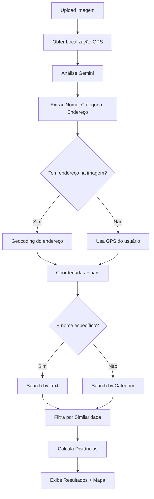

# 🏪 ShopFinder AI

Sistema inteligente de análise de estabelecimentos comerciais usando IA. Identifica automaticamente fachadas de lojas, restaurantes e comércios através de imagens, e busca locais similares próximos ao usuário usando APIs de geolocalização.

  

---

## 🎥 Demonstração

> **Nota**: Adicione aqui um GIF ou vídeo mostrando o app em funcionamento

---

## ✨ Funcionalidades

### 🤖 Análise Inteligente com IA
- Identifica automaticamente o tipo de estabelecimento (restaurante, loja, farmácia, etc.)
- Extrai informações visuais (estilo, cores, arquitetura)
- Detecta texto de endereço/localização na imagem
- Gera tags descritivas automaticamente

### 🗺️ Busca Geolocalizada
- Geocodificação inteligente do local detectado
- Busca de estabelecimentos similares próximos
- Cálculo de distância em tempo real
- Mapa interativo com Mapbox GL JS

### 📱 Interface Responsiva
- Design moderno e clean
- Suporte total para mobile, tablet e desktop
- Histórico de análises realizadas
- Upload via drag-and-drop ou clique

### 🎯 Busca Inteligente
- **Busca por Nome**: Quando detecta um nome específico (ex: "Loja Doce")
- **Busca por Categoria**: Quando detecta apenas tipo genérico (ex: "Restaurante")
- Filtros automáticos de relevância e distância

---

## 🛠️ Tecnologias

### Frontend
- **JavaScript ES6+** (Modules)
- **HTML5** / **CSS3**
- **Google Generative AI** (Gemini 2.0)
- **Mapbox GL JS** (Mapas interativos)
- **Material Symbols** (Ícones)

### APIs Utilizadas
- [Google Gemini API](https://ai.google.dev/) - Análise de imagens com IA
- [Mapbox Geocoding API](https://docs.mapbox.com/api/search/geocoding/) - Conversão de endereços
- [Mapbox Search API](https://docs.mapbox.com/api/search/search/) - Busca de POIs
- [Geolocation API](https://developer.mozilla.org/en-US/docs/Web/API/Geolocation_API) - Localização do usuário

---

## 📦 Pré-requisitos

Antes de começar, você vai precisar:

1. **Chave de API do Google Gemini**
   - Acesse: https://aistudio.google.com/app/apikey
   - Crie uma nova chave de API (gratuita)

2. **Token de Acesso do Mapbox**
   - Acesse: https://account.mapbox.com/
   - Crie uma conta gratuita
   - Gere um token de acesso público

3. **Servidor Web Local** (opcional, mas recomendado)
   - [Live Server](https://marketplace.visualstudio.com/items?itemName=ritwickdey.LiveServer) (VS Code)
   - [http-server](https://www.npmjs.com/package/http-server) (Node.js)
   - Python: `python -m http.server 8000`

---

## 🚀 Instalação

### 1️⃣ Clone o Repositório

```bash
git clone https://github.com/osamuelfox/shopfinder-ai.git
cd shopfinder-ai
```

### 2️⃣ Estrutura de Arquivos

Certifique-se de que a estrutura está assim:

```
shopfinder-ai/
│
├── index.html          # Página principal
├── styles.css          # Estilos do app
├── script.js           # Lógica JavaScript
├── config.js           # Configurações e chaves de API
└── README.md           # Este arquivo
```

## ⚙️ Configuração

### 1. Configure suas Chaves de API

Abra o arquivo `config.js` e substitua as chaves:

```javascript
// config.js

// 1. Sua chave do Google Gemini
export const GEMINI_API_KEY = "AIzaSua_Chave_Aqui"; 

// 2. Seu token do Mapbox
export const MAPBOX_TOKEN = "pk.eyJ1...Seu_Token_Aqui"; 

// 3. Configurações (opcional)
export const APP_CONFIG = {
    language: "pt-BR",
    maxFileSize: 10 * 1024 * 1024, // 10MB
    modelName: "gemini-2.5-flash-exp" // ou "gemini-1.5-flash"
};
```
---

## 🎮 Como Usar

### Opção 1: Servidor Local (Recomendado)

#### Com Python:

```bash
# Python 3
python -m http.server 8000

# Acesse: http://localhost:8000
```
---

## 🎯 Como Funciona

### Passo a Passo:

1. **📸 Upload da Imagem**
   - Clique ou arraste uma foto de fachada de estabelecimento

2. **🤖 Análise com IA**
   - O Gemini analisa a imagem e extrai:
     - Nome do estabelecimento
     - Categoria (restaurante, loja, etc.)
     - Tags descritivas
     - Texto de localização visível

3. **📍 Geocodificação**
   - Converte o endereço detectado em coordenadas GPS

4. **🔍 Busca Inteligente**
   - **Se detectar nome específico** → Busca por nome (ex: "Loja Doce")
   - **Se detectar apenas categoria** → Busca por tipo (ex: "Confeitaria")

5. **🗺️ Exibição dos Resultados**
   - Mapa interativo com sua localização e locais encontrados
   - Lista de estabelecimentos com distância calculada
   - Informações detalhadas de cada local

---

## 📁 Estrutura do Projeto

```
shopfinder-ai/
│
├── 📄 index.html           # Estrutura HTML
│   ├── Sidebar (Histórico)
│   ├── Upload Area
│   └── Results Section (Análise + Mapa)
│
├── 🎨 styles.css           # Estilos CSS
│   ├── Layout Responsivo
│   ├── Componentes UI
│   └── Media Queries
│
├── ⚙️ script.js            # Lógica Principal
│   ├── handleProcess()      → Fluxo principal
│   ├── analyzeWithGemini()  → IA
│   ├── geocodeLocation()    → Mapbox Geocoding
│   ├── searchByText()       → Busca por nome
│   ├── searchByCategory()   → Busca por tipo
│   └── formatResults()      → Formatação
│
└── 🔧 config.js            # Configurações
    ├── GEMINI_API_KEY
    ├── MAPBOX_TOKEN
    └── APP_CONFIG
```

---

## 🔄 Fluxo de Funcionamento



---

## 🐛 Troubleshooting

### Problema: "Configure sua GEMINI_API_KEY"

**Solução:**
1. Verifique se você substituiu `SUA_CHAVE_GEMINI_AQUI` no `config.js`
2. Certifique-se de que a chave começa com `AIza...`
3. Teste a chave em: https://aistudio.google.com/

---

### Problema: Nenhum local encontrado

**Possíveis causas:**
1. **Imagem muito genérica**: Use fotos com fachadas claras
2. **Localização distante**: O app busca num raio de ~50km
3. **Categoria não mapeada**: Verifique o `categoryMap` no código

**Solução:**
- Teste com imagens de estabelecimentos conhecidos
- Permita acesso à localização quando solicitado
- Veja os logs no Console (F12) para debug

---

## 📊 Limitações Conhecidas

- ✅ Funciona melhor com fachadas claras e bem iluminadas
- ✅ Precisa de conexão com internet (APIs)
- ✅ Busca limitada a ~50km de raio
- ✅ Algumas categorias podem não estar mapeadas no Mapbox

---

## 👨‍💻 Autor

Desenvolvido com ❤️ por **Samuel fox**

- GitHub: [@osamuelfox](https://github.com/osamuelfox)
- LinkedIn: [samuels-souza](https://linkedin.com/in/samuels-souza)

---

## 🙏 Agradecimentos

- [Google AI Studio](https://ai.google.dev/) - API Gemini
- [Mapbox](https://www.mapbox.com/) - Mapas e Geocoding
- [Material Symbols](https://fonts.google.com/icons) - Ícones

---

## 📸 Screenshots

### Tela de Upload


### Análise de Estabelecimento


### Mapa de Locais Próximos


### Mobile Responsivo


---

## 🔗 Links Úteis

- [Documentação Google Gemini](https://ai.google.dev/docs)
- [Documentação Mapbox](https://docs.mapbox.com/)

---

**⭐ Se este projeto foi útil, considere dar uma estrela!**
